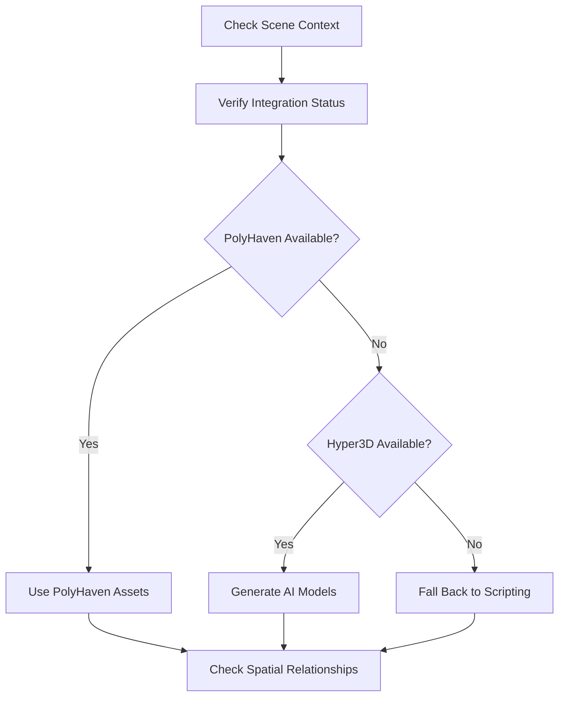
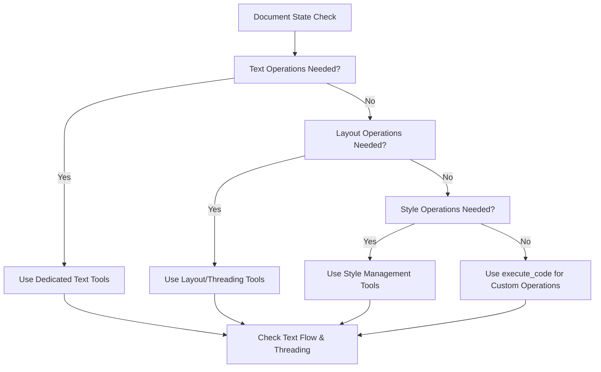

# Learning from BlenderMCP: Improving InDesignMCP's LLM Guidance

## Executive Summary

BlenderMCP provides a sophisticated framework for guiding Claude AI through structured prompts and strategic instructions. This analysis examines their approach to LLM guidance and identifies actionable improvements for InDesignMCP's context and instructions.

**Key Finding**: BlenderMCP uses a dedicated `asset_creation_strategy()` prompt that provides hierarchical workflow guidance, error handling instructions, and context-aware decision making - elements that could significantly enhance InDesignMCP's effectiveness.

## BlenderMCP's LLM Guidance Architecture

### 1. Strategic Prompt System

BlenderMCP implements a comprehensive guidance system through their `asset_creation_strategy()` prompt function:

```python
@mcp.prompt()
def asset_creation_strategy() -> str:
    """Defines the preferred strategy for creating assets in Blender"""
    return """When creating 3D content in Blender, always start by checking if integrations are available:

0. Before anything, always check the scene from get_scene_info()
1. First use the following tools to verify if the following integrations are enabled:
    1. PolyHaven
        Use get_polyhaven_status() to verify its status
        If PolyHaven is enabled:
        - For objects/models: Use download_polyhaven_asset() with asset_type="models"
        - For materials/textures: Use download_polyhaven_asset() with asset_type="textures"
        - For environment lighting: Use download_polyhaven_asset() with asset_type="hdris"
    2. Hyper3D(Rodin)
        ...
"""
```

### 2. Hierarchical Decision Framework

BlenderMCP establishes a clear priority hierarchy:



### 3. Context-Aware Instructions

The system emphasizes understanding context before taking action:
- **Always check scene first**: `get_scene_info()` before any operation
- **Verify capabilities**: Check integration status before attempting to use them
- **Spatial awareness**: Check `world_bounding_box` for proper object placement

### 4. Error Handling and User Guidance

BlenderMCP provides specific instructions for common error scenarios:
- API key limitations and daily limits
- Insufficient balance handling with user guidance
- Fallback strategies when services fail

## Comparative Analysis: BlenderMCP vs InDesignMCP

### Current InDesignMCP Approach

From the CLAUDE.md documentation, InDesignMCP provides:
- Basic project overview and tool descriptions
- General development guidance
- Tool organization by category
- Error handling thresholds

### Gaps Identified

| Aspect | BlenderMCP Strength | InDesignMCP Gap |
|--------|-------------------|----------------|
| **Strategic Guidance** | Dedicated workflow prompt with clear priorities | Limited workflow guidance in instructions |
| **Context Awareness** | Mandatory scene checking before operations | No equivalent "document state" requirement |
| **Tool Hierarchy** | Clear preference order (external assets → AI generation → scripting) | No clear tool usage hierarchy |
| **Error Recovery** | Specific error handling with user guidance | Generic error thresholds without recovery guidance |
| **Spatial/Layout Awareness** | Bounding box and positioning guidance | Limited text flow and layout guidance |

## Recommended Improvements for InDesignMCP

### 1. Implement a Document Strategy Prompt

Create an equivalent to BlenderMCP's `asset_creation_strategy()`:

```python
@mcp.prompt()
def document_creation_strategy() -> str:
    """Defines the preferred strategy for creating documents in InDesign"""
    return """When working with InDesign documents, always follow this workflow:

0. Before anything, check document status with get_document_text() and get_page_info()
1. Verify current document state:
   - Page count and structure
   - Existing text frames and threading
   - Available styles and formatting
2. For text operations, prioritize:
   - Use existing styles when possible
   - Check for overset text before adding content
   - Maintain threading relationships
3. For layout operations:
   - Check page dimensions and margins
   - Verify text frame positions and threading
   - Ensure proper text flow across pages
4. Only use execute_code for:
   - Complex operations not covered by tools
   - Custom formatting requirements
   - Advanced automation tasks
"""
```

### 2. Establish Tool Usage Hierarchy

Define clear preferences for tool selection:



### 3. Context-Aware Document Analysis

Implement mandatory document checking similar to BlenderMCP's scene analysis:

```python
# Before any major operation
def check_document_context():
    """
    Always check:
    1. Document structure (pages, text frames)
    2. Text flow status (overset, threading)
    3. Available styles and formatting
    4. Current selection or insertion point
    """
```

### 4. Enhanced Error Handling with Recovery Guidance

Expand error handling beyond simple thresholds:

```markdown
**Text Flow Issues Recovery**:
- If overset text detected: Use resolve_overset_text()
- If threading broken: Use manage_text_flow() to repair
- If frames misaligned: Use position_textframe() to correct

**Style Application Failures**:
- Check if styles exist with list_paragraph_styles()
- Create missing styles with create_paragraph_style()
- Apply styles systematically with apply_paragraph_style()
```

### 5. Layout and Typography Awareness

Add spatial awareness equivalent to BlenderMCP's bounding box checks:

```python
"""
Typography and Layout Guidelines:
- Always check text frame dimensions before adding content
- Verify text threading before modifying frame structure
- Check for proper text flow across pages
- Ensure adequate spacing and margins
- Validate style consistency across document
"""
```

### 6. Implement Workflow-Specific Guidance

Create context-specific instructions similar to BlenderMCP's integration-specific guidance:

```markdown
**For Magazine Layouts**:
1. Establish master page structure first
2. Create consistent text frame threading
3. Apply paragraph styles for hierarchy
4. Use character styles for emphasis
5. Check text flow and adjust as needed

**For Report Documents**:
1. Set up document structure with proper pagination
2. Create heading hierarchy with paragraph styles
3. Establish consistent text formatting
4. Use threading for body text flow
5. Add page numbers and headers/footers
```

## Implementation Strategy

### Phase 1: Core Strategy Prompt
- Implement document_creation_strategy() prompt
- Add mandatory document state checking
- Establish tool usage hierarchy

### Phase 2: Enhanced Context Awareness
- Add layout and typography guidance
- Implement spatial awareness for text frames
- Create workflow-specific instructions

### Phase 3: Advanced Error Recovery
- Develop specific error handling guidance
- Add recovery strategies for common issues
- Implement user guidance for complex operations

## Code Examples from BlenderMCP

### Asset Creation Strategy Implementation
```python
@mcp.prompt()
def asset_creation_strategy() -> str:
    """Defines the preferred strategy for creating assets in Blender"""
    return """When creating 3D content in Blender, always start by checking if integrations are available:

0. Before anything, always check the scene from get_scene_info()
1. First use the following tools to verify if the following integrations are enabled:
    1. PolyHaven
        Use get_polyhaven_status() to verify its status
        If PolyHaven is enabled:
        - For objects/models: Use download_polyhaven_asset() with asset_type="models"
        - For materials/textures: Use download_polyhaven_asset() with asset_type="textures"
        - For environment lighting: Use download_polyhaven_asset() with asset_type="hdris"
    2. Hyper3D(Rodin)
        Hyper3D Rodin is good at generating 3D models for single item.
        So don't try to:
        1. Generate the whole scene with one shot
        2. Generate ground using Hyper3D
        3. Generate parts of the items separately and put them together afterwards

        Use get_hyper3d_status() to verify its status
        If Hyper3D is enabled:
        - For objects/models, do the following steps:
            1. Create the model generation task
                - Use generate_hyper3d_model_via_images() if image(s) is/are given
                - Use generate_hyper3d_model_via_text() if generating 3D asset using text prompt
                If key type is free_trial and insufficient balance error returned, tell the user that the free trial key can only generated limited models everyday, they can choose to:
                - Wait for another day and try again
                - Go to hyper3d.ai to find out how to get their own API key
                - Go to fal.ai to get their own private API key
            2. Poll the status
                - Use poll_rodin_job_status() to check if the generation task has completed or failed
            3. Import the asset
                - Use import_generated_asset() to import the generated GLB model the asset
            4. After importing the asset, ALWAYS check the world_bounding_box of the imported mesh, and adjust the mesh's location and size
                Adjust the imported mesh's location, scale, rotation, so that the mesh is on the right spot.

            You can reuse assets previous generated by running python code to duplicate the object, without creating another generation task.

3. Always check the world_bounding_box for each item so that:
    - Ensure that all objects that should not be clipping are not clipping.
    - Items have right spatial relationship.


Only fall back to scripting when:
- PolyHaven and Hyper3D are disabled
- A simple primitive is explicitly requested
- No suitable PolyHaven asset exists
- Hyper3D Rodin failed to generate the desired asset
- The task specifically requires a basic material/color
"""
```

### Error Handling Example
BlenderMCP provides specific guidance for API limitations:
```python
"""
If key type is free_trial and insufficient balance error returned, tell the user that the free trial key can only generated limited models everyday, they can choose to:
- Wait for another day and try again
- Go to hyper3d.ai to find out how to get their own API key
- Go to fal.ai to get their own private API key
"""
```

## Conclusion

BlenderMCP's sophisticated approach to LLM guidance offers valuable lessons for InDesignMCP. The key innovations include:

1. **Structured Decision Making**: Clear hierarchical guidance for tool selection
2. **Context Awareness**: Mandatory state checking before operations
3. **Error Recovery**: Specific guidance for common failure scenarios
4. **Spatial Awareness**: Emphasis on spatial relationships and proper positioning
5. **Workflow Integration**: Seamless integration of multiple tools and external services

Implementing these patterns in InDesignMCP would likely result in:
- More consistent and reliable document creation
- Better error handling and recovery
- Improved user experience through predictable workflows
- Enhanced capability utilization through proper tool hierarchy

The next step should be implementing the document_creation_strategy() prompt as a foundation for these improvements, followed by systematic enhancement of context awareness and error handling capabilities.
